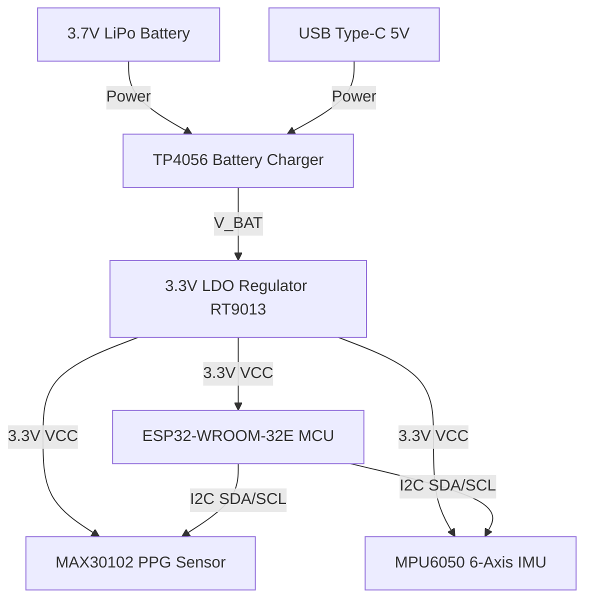

# S.P.H.E.R.E. Wearable Biosensor PCB Schematic Design Specification

This document details the engineering specifications, pinouts, power path configurations, and Bill of Materials (BOM) for the S.P.H.E.R.E. Wearable Telemetry Sensor Pack PCB.

---

## 1. System Block Diagram


---

## 2. Complete Pin-to-Pin ASCII Schematic Diagram

```
                  S.P.H.E.R.E. Wearable Biosensor Schematic Diagram
                  =================================================

    USB Type-C                  TP4056 Battery Charger           RT9013-33 LDO Regulator
   +----------+                +-----------------------+        +-----------------------+
   |   V_BUS  |------[ D1 ]--->| VCC               BAT |---+--->| VIN              VOUT |---+---> VCC_3V3
   |          |    (Schottky)  |                       |   |    |                       |   |
   |  D+/D-   |                | PROG              GND |   |    |          EN       GND |   |
   |          |                +-----------------------+   |    +-----------------------+   |
   |   GND    |---|                        |               |        |                |      |
   +----------+   |                    [ R_prog ]          |      [ R_en ]           |      |
                  |                     (1.2k)             |       (10k)             |      |
                  |                        |               |        |                |      |
                  +------------------------+---------------+--------+----------------+      |
                                           |               |                         |      |
                                          GND            LiPo                        |      |
                                                         (3.7V)                      |      |
                                                                                     |      |
                                             +---------------------------------------+      |
                                             |                                              |
                                            GND                                             |
                                                                                            |
   +----------------------------------------------------------------------------------------+
   |
   +-----+-----------------------+------------------------+
         |                       |                        |
         |                       |                        |
       [ C1 ]                  [ C2 ]                   [ C3 ]
      (10uF)                  (0.1uF)                  (0.1uF)
         |                       |                        |
        GND                     GND                      GND
         |                       |                        |
   +-----+-----------------------+------------------------+-------------------+
   |     |                       |                        |                   |
   |  +-----+                 +-----+                  +-----+             +-----+
   |  | VDD |                 | VDD |                  | VCC |             | VDD |
   |  |     |                 |     |                  |     |             |     |
   |  |     |                 |     |                  |     |             |     |
   |  +-----+                 +-----+                  +-----+             +-----+
   | MAX30102                 MPU6050                ESP32-WROOM         Pull-ups
   | PPG Sensor               IMU Sensor             Microcontroller     I2C SDA/SCL
   +--------------------------------------------------------------------------+
                                                                              |
                                     VCC_3V3                                  |
                                        |                                     |
                                   +----+----+                                |
                                   |         |                                |
                                [ R_sda ] [ R_scl ]                           |
                                 (4.7k)    (4.7k)                             |
                                   |         |                                |
                                   +----+----+                                |
                                        |                                     |
   MAX30102 SDA ------------------------+------------------ GPIO21 (SDA)      |
   MAX30102 SCL ------------------------+------------------ GPIO22 (SCL)      |
   MPU6050 SDA  ------------------------+                                     |
   MPU6050 SCL  ------------------------+                                     |
                                                                              |
   MAX30102 INT ------------------------------------------- GPIO19 (INT)      |
                                                                              |
   ESP32 EN (Reset) ------------+------------[ R_pu (10k) ]-- VCC_3V3          |
                                |                                             |
                              [ C_db (0.1uF) ]                                |
                                |                                             |
                               GND                                            |
                                                                              |
   ESP32 GPIO0 (Boot) ----------+----[ SW_BOOT (Tactile Switch) ]---> GND     |
                                |                                             |
                                VCC_3V3                                       |
```

---

## 3. Bill of Materials (BOM)

| Designator | Qty | Value/Part | Package | Manufacturer Part # | Description |
| :--- | :---: | :--- | :--- | :--- | :--- |
| **U1** | 1 | ESP32-WROOM-32E-N4 | SMD-38 | ESP32-WROOM-32E | Dual-core Wi-Fi/BT MCU (4MB Flash) |
| **U2** | 1 | MAX30102 | OLGA-14 | MAX30102EFD+T | Optical PPG Pulse-Oximeter & HR Sensor |
| **U3** | 1 | MPU6050 | QFN-24 | MPU-6050 | 6-Axis Gyroscope/Accelerometer IMU |
| **U4** | 1 | TP4056 | SOP-8 | TP4056-ES | Constant-Current Lithium Battery Charger |
| **U5** | 1 | RT9013-33GB | SOT-23-5 | RT9013-33GB | 500mA Low-Dropout (LDO) Linear Regulator |
| **C1** | 1 | 10uF | 0805 | GRM21BR71A106KE51L | Ceramic Decoupling Capacitor (LDO Input filter) |
| **C2** | 1 | 10uF | 0805 | GRM21BR71A106KE51L | Ceramic Decoupling Capacitor (LDO Output filter) |
| **C3, C4, C5**| 3 | 0.1uF | 0603 | GRM188R71H104KA93D | Ceramic Decoupling Capacitors (Sensor VDD pins) |
| **C6** | 1 | 0.1uF | 0603 | GRM188R71H104KA93D | Debounce Capacitor (ESP32 EN pin) |
| **R_sda, R_scl**| 2 | 4.7k Ohm | 0603 | RC0603FR-074K7L | I2C SDA/SCL pull-up resistors |
| **R_prog** | 1 | 1.2k Ohm | 0603 | RC0603FR-071K2L | TP4056 charge current program resistor (1A) |
| **R_en, R_pu**| 2 | 10k Ohm | 0603 | RC0603FR-0710KL | Pull-up resistors (RT9013 EN, ESP32 EN) |
| **D1** | 1 | MBRA140T3G | SMA (DO-214AC) | MBRA140T3G | Schottky Diode (V_BUS reverse flow guard) |
| **SW1, SW2** | 2 | Tactile Switch | SMD-4 | PTS645VL392LFS | Push Buttons (ESP32 EN/RESET & BOOT/GPIO0) |
| **J1** | 1 | USB Type-C | SMD-16 | USB4105-GF-A | USB Type-C Receptacle (Power input only) |
| **BAT1** | 1 | LiPo Battery | 2-pin JST-PH | LiPo-3.7V-1000mAh | 3.7V 1000mAh Lithium Polymer Battery Pack |

---

## 4. Key Component Selection & Pin Assignments

### A. Microcontroller: ESP32-WROOM-32E-N4
* **Purpose**: Wi-Fi enabled client to stream WebSocket packets to the S.P.H.E.R.E. gateway.
* **Pins Used**:
  - `GPIO21 / SDA` $\rightarrow$ Connected to I2C Data bus.
  - `GPIO22 / SCL` $\rightarrow$ Connected to I2C Clock bus.
  - `EN (Reset)` $\rightarrow$ Connected to a tactile push button with a $10\text{k}\Omega$ pull-up resistor to $3.3\text{V}$ and a $0.1\mu\text{F}$ debounce capacitor.
  - `GPIO0` $\rightarrow$ Connected to a Boot push button (grounded when pressed) for firmware flashing.
  - `TXD0 / RXD0` $\rightarrow$ Routed to CP2102 USB-to-UART bridge for debugging and flashing.

### B. Heart-Rate & SpO2 Sensor: MAX30102
* **Purpose**: Optical pulse-oximetry PPG data collection.
* **Pins Used**:
  - `VDD` $\rightarrow$ Connected to $3.3\text{V}$ with $0.1\mu\text{F}$ and $10\mu\text{F}$ decoupling capacitors.
  - `GND` $\rightarrow$ System Ground.
  - `SDA / SCL` $\rightarrow$ Connected to the I2C bus with $4.7\text{k}\Omega$ pull-up resistors to $3.3\text{V}$.
  - `INT` $\rightarrow$ Routed to `GPIO19` on ESP32 (active-low interrupt line for data-ready trigger).

### C. Kinematic Accelerometer: MPU6050
* **Purpose**: G-force monitoring and hand/body tremor detection.
* **Pins Used**:
  - `VCC` $\rightarrow$ Connected to $3.3\text{V}$ (filtered by $0.1\mu\text{F}$ decoupling capacitor).
  - `GND` $\rightarrow$ System Ground.
  - `SDA / SCL` $\rightarrow$ Connected to the common I2C bus.
  - `AD0` $\rightarrow$ Grounded to select I2C address `0x68`.

---

## 5. Power Path & Battery Charging Circuit

To support a portable wearable configuration, the PCB includes a Lipo charger and voltage regulator circuit:

1. **Battery Charger (TP4056)**:
   - Input: 5V from USB Type-C.
   - Charge Current: Configured via a $1.2\text{k}\Omega$ resistor on `PROG` pin for $1000\text{mA}$ charging speed.
   - Status LEDs: Red (charging) and Blue (standby/complete) connected to open-drain status outputs.
2. **Voltage Regulator (RT9013-33GB)**:
   - Input: $3.7\text{V} - 4.2\text{V}$ LiPo battery output.
   - Output: Stable $3.3\text{V}$ DC at up to $500\text{mA}$.
   - Noise Filter: $10\mu\text{F}$ low-ESR ceramic capacitors on Input and Output rails.

---

## 6. PCB Layout and Noise Minimization Guidelines

- **Star Grounding**: Separate the high-frequency return paths of the ESP32 Wi-Fi RF section from the low-noise analog return paths of the MAX30102 optical sensor. Connect the analog ground plane to the digital ground plane at a single point (near the battery connector) to eliminate ground loop voltage fluctuations.
- **I2C Signal Integrity**: Route `SDA` and `SCL` lines as differential pairs of equal length. Keep trace lengths below 50mm and place $4.7\text{k}\Omega$ pull-up resistors close to the MCU to minimize capacitive load and maintain sharp signal rise times under $100\text{kHz}$ Clock speeds.
- **Decoupling Capacitor Placement**: Place the $0.1\mu\text{F}$ ceramic bypass capacitors as close as physically possible to the `VDD`/`VCC` pins of the MAX30102 and MPU6050 (within 2mm). This provides a local low-impedance energy reservoir to filter high-frequency noise induced by the ESP32 transmitter.
